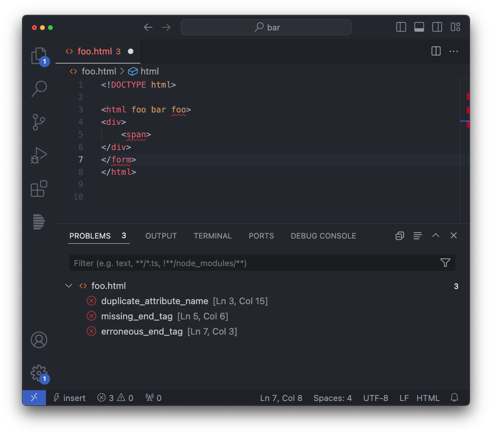

# SuperHTML
HTML Language Server and Templating Language Library


## HTML Language Server
The Super CLI Tool offers **syntax checking** and **autoformatting** features for HTML files.

The tool can be used either directly (for example by running it on save), or through a LSP client implementation.

```
$ super
Usage: super COMMAND [OPTIONS]

Commands:
  fmt          Format HTML documents
  lsp          Start the Super LSP
  help         Show this menu and exit

General Options:
  --help, -h   Print command specific usage  
```

### Diagnostics



This language server is stricter than the HTML spec whenever it would prevent potential human errors from being reported.


As an example, HTML allows for closing some tags implicitly. For example the following snippet is correct HTML.

```html
<ul>
  <li> One
  <li> Two
</ul>
```

This will still be reported as an error by SuperHTML because otherwise the following snippet would have to be considered correct (while it's most probably a typo):

```html
<h1>Title<h1>
```

### Autoformatting


The autoformatter has two main ways of interacting with it in order to request for horizontal / vertical alignment.

1. Adding / removing whitespace between the **start tag** of an element and its content.
2. Adding / removing whitespace between the **last attribute** of a start tag and the closing  `>`.


#### Example of rule #1
Before:
```html
<div> <p>Foo</p></div>
```

After:
```html
<div> 
    <p>Foo</p>
</div>
```

##### Reverse

Before:
```html
<div><p>Foo</p>
</div>
```

After:
```html
<div><p>Foo</p></div>
```

#### Example of rule #2
Before:
```html
<div foo="bar" style="verylongstring" >
    Foo
</div>
```

After:
```html
<div 
   foo="bar" 
   style="verylongstring" 
>
    Foo
</div>
```

##### Reverse

Before:
```html
<div 
   foo="bar" 
   style="verylongstring">
    Foo
</div>
```

After:
```html
<div foo="bar" style="verylongstring">
    Foo
</div>
```

### Editor support
#### VSCode
1. Download a prebuilt version of `superhtml` from the Releases section (or build it yourself).
2. Put `superhtml` in your `PATH`.
3. Install the [Super HTML VSCode extension](https://marketplace.visualstudio.com/items?itemName=LorisCro.super). 

#### Helix
Add to your `.config/helix/languages.toml`:
```toml
[language-server.superhtml-lsp]
command = "superhtml"
args = ["lsp"]

[[language]]
name = "html"
scope = "source.html"
roots = []
file-types = ["html"]
language-servers = [ "superhtml-lsp" ]
```
See https://helix-editor.com for more information on how to add new language servers.

#### [Flow](https://github.com/neurocyte/flow)
Already defaults to using SuperHTML, just add the executable to your `PATH`.

#### Other editors
Follow your editor specific intructions on how to define a new Language Server for a given language / file format.

*(Also feel free to contribute more specific intructions to this readme / add files under the `editors/` subdirectory).*

## Templating Language Library
SuperHTML is also a HTML templating language. More on that soon.

## Contributing
SuperHTML tracks the latest Zig release (0.13.0 at the moment of writing). 

### Contributing to the HTML paser & LSP
Contributing to the HTML parser and LSP doesn't require you to be familiar with the templating language, basically limiting the scope of what you have to worry about to:

- `src/cli.zig`
- `src/cli/`
- `src/html/`

In particular, you will care about `src/html/Tokenizer.zig` and `src/html/Ast.zig`.

You can run `zig test src/html/Ast.zig` to run parser unit tests without needing to worry the rest of the project.

Running `zig build` will compile the Super CLI tool, allowing you to also then test the LSP behavior directly from your favorite editor.

The LSP will log in your cache directory so you can `tail -f ~/.cache/super/super.log` to see what happens with the LSP.

