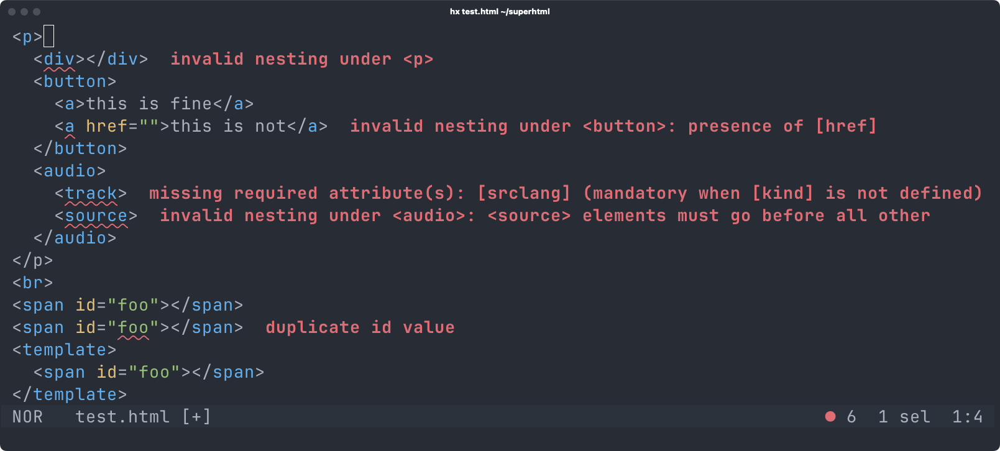

# SuperHTML
HTML Linter, Formatter, LSP, and Templating Language Library

## SuperHTML CLI Tool
The SuperHTML CLI Tool offers **validation** and **autoformatting** features for HTML files.

The tool can be used either directly (for example by running it on save), or through a LSP client implementation.

```
$ superhtml
Usage: superhtml COMMAND [OPTIONS]

Commands:
  check         Check documents for errors.
  fmt           Format documents.
  lsp           Start the Language Server.
  help          Show this menu and exit.
  version       Print the version and exit.

General Options:
  --help, -h        Print command specific usage.
  --syntax-only     Disable HTML element and attribute validation.
```

>[!WARNING]
>SuperHTML only supports HTML5 (the WHATWG living spec) regardless of what you put in your doctype (a warning will be generated for unsupported doctypes).

### Diagnostics
SuperHTML validates not only syntax but also element nesting and attribute values.
No other language server implements the full HTML spec in its validation code.




### Autoformatting
The autoformatter has two main ways of interacting with it in order to request for horizontal / vertical alignment.

1. Adding / removing whitespace between the **start tag** of an element and its content.
2. Adding / removing whitespace between the **last attribute** of a start tag and the closing  `>`.


#### Example of rule #1
Before:
```html
<div> <p>Foo</p></div>
```

After:
```html
<div>
    <p>Foo</p>
</div>
```

##### Reverse

Before:
```html
<div><p>Foo</p>
</div>
```

After:
```html
<div><p>Foo</p></div>
```

### Example of rule #2
Before:
```html
<div foo="bar" style="verylongstring" hidden >
    Foo
</div>
```

After:
```html
<div foo="bar" 
     style="verylongstring" 
     hidden
>
    Foo
</div>
```

#### Reverse

Before:
```html
<div foo="bar" 
     style="verylongstring"
     hidden>
    Foo
</div>
```

After:
```html
<div foo="bar" style="verylongstring" hidden>
    Foo
</div>
```

### Download
See the Releases section here on GitHub.

### Editor support
#### VSCode
Install the [Super HTML VSCode extension](https://marketplace.visualstudio.com/items?itemName=LorisCro.super) (doesn't require the CLI tool as it bundles a WASM build of the language server).

#### Neovim
1. Download a prebuilt version of `superhtml` from the Releases section (or build it yourself).
2. Put `superhtml` in your `PATH`.
3. Configure `superhtml` for your chosen lsp

	- ##### [Neovim Built-In](https://neovim.io/doc/user/lsp.html#vim.lsp.start())

		```lua
		vim.api.nvim_create_autocmd("Filetype", {
			pattern = { "html", "shtml", "htm" },
			callback = function()
				vim.lsp.start({
					name = "superhtml",
					cmd = { "superhtml", "lsp" },
					root_dir = vim.fs.dirname(vim.fs.find({".git"}, { upward = true })[1])
				})
			end
		})
		```

	- ##### [LspZero](https://github.com/VonHeikemen/lsp-zero.nvim)

		```lua
		local lsp = require("lsp-zero")

		require('lspconfig.configs').superhtml = {
				default_config = {
						name = 'superhtml',
						cmd = {'superhtml', 'lsp'},
						filetypes = {'html', 'shtml', 'htm'},
						root_dir = require('lspconfig.util').root_pattern('.git')
				}
		}

		lsp.configure('superhtml', {force_setup = true})
		```

#### Helix
In versions later than `24.07` `superhtml` is supported out of the box, simply add executable to your `PATH`.


#### [Flow Control](https://github.com/neurocyte/flow)
Already defaults to using SuperHTML, just add the executable to your `PATH`.

#### Vim
Vim should be able to parse the errors that `superhtml check [PATH]` generates.
This means that you can use `:make` and the quickfix window to check for syntax
errors.

Set the `makeprg` to the following in your .vimrc:
```
" for any html file, a :make<cr> action will populate the quickfix menu
autocmd filetype html setlocal makeprg=superhtml\ check\ %
" if you want to use gq{motion} to format sections or the whole buffer (with gggqG)
autocmd filetype html setlocal formatprg=superhtml\ fmt\ --stdin
```

#### Zed
See [WeetHet/superhtml-zed](https://github.com/WeetHet/superhtml-zed).

#### Other editors
Follow your editor specific instructions on how to define a new Language Server for a given language / file format.

*(Also feel free to contribute more specific instructions to this readme / add files under the `editors/` subdirectory).*


## FAQs
### Why doesn't SuperHTML support self-closing tags?
Because self-closing tags don't exist in HTML and, while harmless when used with void elements, it just keeps misleating people into thinking that you can self-close HTML tags.

In particular, given this HTML code:

```html
<!doctype html>
<html> 
  <head></head>
  <body>
  <div/>
    <p></p>
  </body>
</html>
```

You might think that `<div>` and `<p>` are siblings, while in reality browsers are required **by the spec** to ignore the self-closing slash in `<div/>`, making `<p>` a child, not a sibling of it.

Add to that the fact that tooling like the default HTML formatter in VSCode will provide misleading autoformatting (try it yourself, disable SuperHTML in VSCode and autoformat the snippet above), to this day people are way more confused about HTML than they need to be.

Related: [#100](https://github.com/kristoff-it/superhtml/pull/100).

### Why doesn't SuperHTML report duplicate values in `[class]` as an error?
The HTML spec defines the global `class` attribute as a space-separated list of tokens, as opposed to a space-separated list of *unique* tokens, like some other attributes are (e.g. `accesskey`).

### Why is `<style>` under `<body>` an error? It works in all browsers!
As far as I'm concerned, there is no good reason to forbid `<style>` in body, but that's what the HTML spec does.

Related upstream issue: https://github.com/whatwg/html/issues/1605

 
## Templating Language Library
SuperHTML is also a HTML templating language. More on that soon.

## Contributing
SuperHTML tracks the latest Zig release (0.15.1 at the moment of writing).

### Contributing to the HTML parser & LSP
Contributing to the HTML parser and LSP doesn't require you to be familiar with the templating language, basically limiting the scope of what you have to worry about to:

- `src/cli.zig`
- `src/cli/`
- `src/html/`

In particular, you will care about the source files under `src/html`.

You can invoke `zig build test` to run all unit tests.

Running `zig build` will compile the SuperHTML CLI tool, allowing you to also then test the LSP behavior directly from your favorite editor.

For testing within VSCode:
1. Run `zig build wasm -p src/editors/vscode/wasm`
2. Open `src/editors/vscode` in VSCode
3. Start debugging.

Debug builds will produce logs in your cache directory so you can `tail -f ~/.cache/superhtml.log`.
